```
Python 3.10.16
pip install torch==2.2.2 torchvision==0.17.2 torchaudio==2.2.2 --index-url https://download.pytorch.org/whl/cu121

conda activate mind

channels:
  - defaults
custom_channels:
  conda-forge: https://mirrors.tuna.tsinghua.edu.cn/anaconda/cloud
  msys2: https://mirrors.tuna.tsinghua.edu.cn/anaconda/cloud
  bioconda: https://mirrors.tuna.tsinghua.edu.cn/anaconda/cloud
  menpo: https://mirrors.tuna.tsinghua.edu.cn/anaconda/cloud
  pytorch: https://mirrors.tuna.tsinghua.edu.cn/anaconda/cloud
  simpleitk: https://mirrors.tuna.tsinghua.edu.cn/anaconda/cloud
default_channels:
  - https://mirrors.tuna.tsinghua.edu.cn/anaconda/pkgs/main
  - https://mirrors.tuna.tsinghua.edu.cn/anaconda/pkgs/r
  - https://mirrors.tuna.tsinghua.edu.cn/anaconda/pkgs/msys2
show_channel_urls: True
```

# **项目包含**

- my_minimind-LLM结构的全部代码（Dense+MoE模型）。
- 包含Tokenizer分词器详细训练代码。
- 包含Pretrain、SFT、LoRA、RLHF-DPO、模型蒸馏的全过程训练代码。
- 收集、蒸馏、整理并清洗去重所有阶段的高质量数据集，且全部开源。
- 从0实现预训练、指令微调、LoRA、DPO强化学习，白盒模型蒸馏。关键算法几乎不依赖第三方封装的框架，且全部开源。
- 同时兼容`transformers`、`trl`、`peft`等第三方主流框架。
- 训练支持单机单卡、单机多卡(DDP、DeepSpeed)训练，支持wandb可视化训练流程。支持动态启停训练。
- 在第三方测评榜（C-Eval、C-MMLU、OpenBookQA等）进行模型测试。
- 实现Openai-Api协议的极简服务端，便于集成到第三方ChatUI使用（FastGPT、Open-WebUI等）。
- 基于streamlit实现最简聊天WebUI前端。
- 复现(蒸馏/RL)大型推理模型DeepSeek-R1的my_minimind-Reason模型，**数据+模型**全部开源

# 📌 快速开始

<details style="color:rgb(128,128,128)">
<summary>分享本人的软硬件配置（仅供参考）</summary>


* CPU: Intel(R) Core(TM) i9-10980XE CPU @ 3.00GHz
* RAM: 128 GB
* GPU: NVIDIA GeForce RTX 3090(24GB) * 8
* Ubuntu==20.04
* CUDA==12.1
* Python==3.10.16
* [requirements.txt](./requirements.txt)

</details>

```bash
git clone https://github.com/jingyaogong/my_minimind.git
```

## Ⅰ 测试已有模型效果

### 1.环境准备

```bash
pip install -r requirements.txt -i https://pypi.tuna.tsinghua.edu.cn/simple
```

### 2.下载模型

```bash
# my_minimind2放在my_minimind的根目录
git clone https://huggingface.co/jingyaogong/my_minimind2
```

### 3.启动WebUI

```bash
# 可能需要`python>=3.10` 安装 `pip install streamlit`
cd scripts
streamlit run web_demo.py
```

## 开始训练

### 预训练(Pretrain)（学知识）

这个过程是“无监督”的，即人类不需要在过程中做任何“有监督”的校正，而是由模型自己从大量文本中总结规律学习知识点。
模型此阶段目的只有一个：**学会词语接龙**。例如我们输入“秦始皇”四个字，它可以接龙“是中国的第一位皇帝”。

> ```bash
> python train_pretrain.py
> ```
>
> 训练后的模型权重文件默认每隔`100步`保存为 `pretrain_*.pth` 作为预训练的输出权重（其中*为模型的dimension，默认为512）

### 有监督微调(Supervised Fine-Tuning):（学对话方式）

SFT阶段就需要把半成品LLM施加一个自定义的聊天模板进行微调。
例如模型遇到这样的模板【问题->回答，问题->回答】后不再无脑接龙，而是意识到这是一段完整的对话结束。
称这个过程为指令微调，就如同让已经学富五车的「牛顿」先生适应21世纪智能手机的聊天习惯，学习屏幕左侧是对方消息，右侧是本人消息这个规律。
在训练时，my_minimind的指令和回答长度被截断在512，是为了节省显存空间。就像我们学习时，会先从短的文章开始，当学会写作200字作文后，800字文章也可以手到擒来。

> ```bash
> python train_full_sft.py
> ```
>
> 执行监督微调，得到 `full_sft_*.pth` 作为指令微调的输出权重（其中`full`即为全参数微调）
>
> <details style="color:rgb(128,128,128)">
> <summary>注：训练须知</summary>
>
> 
>
> 所有训练过程默认每隔100步保存1次参数到文件`./out/***.pth`（每次会覆盖掉旧权重文件）。
>
> 简单起见，此处只写明两个阶段训练过程。如需其它训练 (LoRA, 蒸馏, 强化学习, 微调推理等) 可参考下文【实验】小节的详细说明。

### 人类反馈强化学习(Reinforcement Learning from Human Feedback, RLHF)**

在前面的训练步骤中，模型已经具备了基本的对话能力，但是这样的能力完全基于单词接龙，缺少正反样例的激励。
模型此时尚未知什么回答是好的，什么是差的。我们希望它能够更符合人的偏好，降低让人类不满意答案的产生概率。
这个过程就像是让模型参加新的培训，从优秀员工的作为例子，消极员工作为反例，学习如何更好地回复。
此处使用的是RLHF系列之-直接偏好优化(Direct Preference Optimization, DPO)。
与PPO(Proximal Policy Optimization)这种需要奖励模型、价值模型的RL算法不同；
DPO通过推导PPO奖励模型的显式解，把在线奖励模型换成离线数据，Ref模型输出可以提前保存。
DPO性能几乎不变，只用跑 actor_model 和 ref_model 两个模型，大大节省显存开销和增加训练稳定性。

> 注：RLHF训练步骤**并非必须**，此步骤难以提升模型“智力”而通常仅用于提升模型的“礼貌”，有利（符合偏好、减少有害内容）也有弊（样本收集昂贵、反馈偏差、多样性损失）。

```bash
torchrun --nproc_per_node 1 train_dpo.py
# or
python train_dpo.py
```

> 训练后的模型权重文件默认每隔`100步`保存为: `rlhf_*.pth`（*
> 为模型具体dimension，每次保存时新文件会覆盖旧文件）

full_sft模型在简洁性和信息准确性方面表现更好；rlhf模型在回答中倾向于提供更多的背景信息，但信息准确性有待改进。
总的来说RLHF后的模型倾向于学习：说更多有礼貌但无用的废话讨好“对话”本身，而对信息准确性则有轻微损失。
天下没有免费的午餐，还需要继续提升RLHF数据集的质量，也要接受模型能力无法避免的损失(程度有轻重)。
DPO和在线PPO的区别在于reject和chosen都是离线准备的，和my_minimind模型本身的输出必然存在很大的分布差异。
通俗地说DPO算法使模型观看乒乓球世界冠军的打法「录像」进行RL，而不是像PPO一样请reward模型做「教练」纠正自己的打法进行RL

### 知识蒸馏(Knowledge Distillation, KD)

在前面的所有训练步骤中，模型已经完全具备了基本能力，通常可以学成出师了。
而知识蒸馏可以进一步优化模型的性能和效率，所谓知识蒸馏，即学生模型面向教师模型学习。
教师模型通常是经过充分训练的大模型，具有较高的准确性和泛化能力。
学生模型是一个较小的模型，目标是学习教师模型的行为，而不是直接从原始数据中学习。
在SFT学习中，模型的目标是拟合词Token分类硬标签（hard labels），即真实的类别标签（如 0 或 6400）。
在知识蒸馏中，教师模型的softmax概率分布被用作软标签（soft labels）。小模型仅学习软标签，并使用KL-Loss来优化模型的参数。
通俗地说，SFT直接学习老师给的解题答案。而KD过程相当于“打开”老师聪明的大脑，尽可能地模仿老师“大脑”思考问题的神经元状态。
例如，当老师模型计算`1+1=2`这个问题的时候，最后一层神经元a状态为0，神经元b状态为100，神经元c状态为-99...
学生模型通过大量数据，学习教师模型大脑内部的运转规律。这个过程即称之为：知识蒸馏。
知识蒸馏的目的只有一个：让小模型体积更小的同时效果更好。
然而随着LLM诞生和发展，模型蒸馏一词被广泛滥用，从而产生了“白盒/黑盒”知识蒸馏两个派别。
GPT-4这种闭源模型，由于无法获取其内部结构，因此只能面向它所输出的数据学习，这个过程称之为黑盒蒸馏，也是大模型时代最普遍的做法。
黑盒蒸馏与SFT过程完全一致，只不过数据是从大模型的输出收集，因此只需要准备数据并且进一步FT即可。
注意更改被加载的基础模型为`full_sft_*.pth`，即基于微调模型做进一步的蒸馏学习。
`./dataset/sft_1024.jsonl`与`./dataset/sft_2048.jsonl` 均收集自qwen2.5-7/72B-Instruct大模型，可直接用于SFT以获取Qwen的部分行为。

```bash
# 注意需要更改train_full_sft.py数据集路径，以及max_seq_len  
torchrun --nproc_per_node 1 train_full_sft.py
# or
python train_full_sft.py
```

> 训练后的模型权重文件默认每隔`100步`同样保存为: `full_sft_*.pth`（*为模型具体dimension，每次保存时新文件会覆盖旧文件）

此处应当着重介绍my_minimind实现的白盒蒸馏代码`train_distillation.py`，由于my_minimind同系列本身并不存在强大的教师模型，因此白盒蒸馏代码仅作为学习参考。

```bash
torchrun --nproc_per_node 1 train_distillation.py
# or
python train_distillation.py
```

### LoRA (Low-Rank Adaptation)

LoRA是一种高效的参数高效微调（Parameter-Efficient Fine-Tuning, PEFT）方法，旨在通过低秩分解的方式对预训练模型进行微调。
相比于全参数微调（Full Fine-Tuning），LoRA 只需要更新少量的参数。
LoRA 的核心思想是：在模型的权重矩阵中引入低秩分解，仅对低秩部分进行更新，而保持原始预训练权重不变。
代码可见`./model/model_lora.py`和`train_lora.py`，完全从0实现LoRA流程，不依赖第三方库的封装。

```bash
torchrun --nproc_per_node 1 train_lora.py
# or
python train_lora.py
```

> 训练后的模型权重文件默认每隔`100步`保存为: `lora_xxx_*.pth`（*
> 为模型具体dimension，每次保存时新文件会覆盖旧文件）

非常多的人困惑，如何使模型学会自己私有领域的知识？如何准备数据集？如何迁移通用领域模型打造垂域模型？
这里举几个例子，对于通用模型，医学领域知识欠缺，可以尝试在原有模型基础上加入领域知识，以获得更好的性能。
同时，我们通常不希望学会领域知识的同时损失原有基础模型的其它能力，此时LoRA可以很好的改善这个问题。
只需要准备如下格式的对话数据集放置到`./dataset/lora_xxx.jsonl`，启动 `python train_lora.py`
训练即可得到`./out/lora/lora_xxx.pth`新模型权重。

此时【基础模型+LoRA模型】即可获得医疗场景模型增强的能力，相当于为基础模型增加了LoRA外挂，这个过程并不损失基础模型的本身能力。
我们可以通过`eval_model.py`进行模型评估测试。

### 训练推理模型 (Reasoning Model)

DeepSeek-R1实在太火了，几乎重新指明了未来LLM的新范式。
论文指出`>3B`的模型经历多次反复的冷启动和RL奖励训练才能获得肉眼可见的推理能力提升。
最快最稳妥最经济的做法，以及最近爆发的各种各样所谓的推理模型几乎都是直接面向数据进行蒸馏训练，
但由于缺乏技术含量，蒸馏派被RL派瞧不起（hhhh）。
本人迅速已经在Qwen系列1.5B小模型上进行了尝试，很快复现了Zero过程的数学推理能力。
然而一个遗憾的共识是：参数太小的模型直接通过冷启动SFT+GRPO几乎不可能获得任何推理效果。
my_minimind2第一时间只能坚定不移的选择做蒸馏派，日后基于0.1B模型的RL如果同样取得小小进展会更新此部分的训练方案。

做蒸馏需要准备的依然是和SFT阶段同样格式的数据即可，数据集来源已如上文介绍。数据格式例如：

```json lines
{
  "conversations": [
    {
      "role": "user",
      "content": "你好，我是小芳，很高兴认识你。"
    },
    {
      "role": "assistant",
      "content": "<think>\n你好！我是由中国的个人开发者独立开发的智能助手my_minimind-R1-Lite-Preview，很高兴为您提供服务！\n</think>\n<answer>\n你好！我是由中国的个人开发者独立开发的智能助手my_minimind-R1-Lite-Preview，很高兴为您提供服务！\n</answer>"
    }
  ]
}
```

推理模型R1的回复模板是：

```text
<think>\n思考过程\n</think>\n
<answer>\n最终回答\n</answer>
```

这在GRPO中通过设置规则奖励函数约束模型符合思考标签和回复标签（在冷启动靠前的阶段奖励值设置应该提高一些）

另一个问题是蒸馏过程虽然和SFT一样，但实验结果是模型难以每次都符合模板规范的回复，即脱离思考和回复标签约束。
这里的小技巧是增加标记位置token的损失惩罚，详见`train_distill_reason.py`:

```text
# 在 sp_ids 对应的位置增加额外的惩罚
...
loss_mask[sp_ids] = 10 # 惩罚系数
```

另另一个tips是由于推理数据由于只筛选了`<1024`长度的数据，其中多轮对话和英文数据偏少，
因此`r1_mix_1024.jsonl`进行了大约10k条多轮对话+英文数据的混合，防止模型遗忘严重。

脚本默认基于rlhf后的基模型做推理能力的蒸馏微调，下面直接启动训练即可：

```bash
torchrun --nproc_per_node 1 train_distill_reason.py
# or
python train_distill_reason.py
```

> 训练后的模型权重文件默认每隔`100步`保存为: `reason_*.pth`（*为模型具体dimension，每次保存时新文件会覆盖旧文件）


## 测试模型效果

确保需要测试的模型`*.pth`文件位于`./out/`目录下。
也可以直接去[此处](https://www.modelscope.cn/models/gongjy/my_minimind2-PyTorch/files)下载使用我训练的`*.pth`文件。

```bash
python eval_model.py --model_mode 1 # 默认为0：测试pretrain模型效果，设置为1：测试full_sft模型效果
```

<details style="color:rgb(128,128,128)">
<summary>注：测试须知</summary>


如需详情，查看`eval_model.py`脚本代码即可。model_mode分为 0: 预训练模型，1: SFT-Chat模型，2: RLHF-Chat模型，3: Reason模型

## Tokenizer

./scripts/train_tokenizer.py

```
# 一些自言自语
> 尽管my_minimind_tokenizer长度很小，编解码效率弱于qwen2、glm等中文友好型分词器。
> 但my_minimind模型选择了自己训练的my_minimind_tokenizer作为分词器，以保持整体参数轻量，避免编码层和计算层占比失衡，头重脚轻，因为my_minimind的词表大小只有6400。
> 且my_minimind在实际测试中没有出现过生僻词汇解码失败的情况，效果良好。
> 由于自定义词表压缩长度到6400，使得LLM总参数量最低只有25.8M。
> 训练数据`tokenizer_train.jsonl`均来自于`匠数大模型数据集`，这部分数据相对次要，如需训练可以自由选择。
```

## 训练数据

### Pretrain数据

尝试把[匠数大模型数据集](https://www.modelscope.cn/datasets/deepctrl/deepctrl-sft-data)的中文部分提取出来，清洗出字符`<512`长度的大约1.6GB的语料直接拼接成预训练数据 

文件`pretrain_hq.jsonl` (1.6GB) 数据格式为

```bash
{"text": "如何才能摆脱拖延症？ 治愈拖延症并不容易，但以下建议可能有所帮助..."}
```

### SFT数据

`sft_mini_512.jsonl`(~1.2GB)。

所有sft文件 `sft_X.jsonl` 数据格式均为

```text
{
    "conversations": [
        {"role": "user", "content": "你好"},
        {"role": "assistant", "content": "你好！"},
        {"role": "user", "content": "再见"},
        {"role": "assistant", "content": "再见！"}
    ]
}
```

### RLHF数据

文件 `dpo.jsonl` 数据格式为

```text
{
  "chosen": [
    {"content": "Q", "role": "user"}, 
    {"content": "good answer", "role": "assistant"}
  ], 
  "rejected": [
    {"content": "Q", "role": "user"}, 
    {"content": "bad answer", "role": "assistant"}
  ]
}
```


https://www.bilibili.com/list/watchlater?oid=1201309534&bvid=BV1GF4m1L7Nt&spm_id_from=333.1365.top_right_bar_window_view_later.content.click

### 数据集下载

将下载的数据集文件放到`./dataset/`目录下（✨为推荐的必须项）

```bash
./dataset/
├── dpo.jsonl (909MB)
├── lora_identity.jsonl (22.8KB)
├── lora_medical.jsonl (34MB)
├── pretrain_hq.jsonl (1.6GB, ✨)
├── r1_mix_1024.jsonl (340MB)
├── sft_1024.jsonl (5.6GB)
├── sft_2048.jsonl (9GB)
├── sft_512.jsonl (7.5GB)
├── sft_mini_512.jsonl (1.2GB, ✨)
└── tokenizer_train.jsonl (1GB)
```

<details style="color:rgb(128,128,128)">
<summary>注：各数据集简介</summary>


* `dpo.jsonl` --RLHF阶段数据集
* `lora_identity.jsonl` --自我认知数据集（例如：你是谁？我是my_minimind...），推荐用于lora训练（亦可用于全参SFT，勿被名字局限）
* `lora_medical.jsonl` --医疗问答数据集，推荐用于lora训练（亦可用于全参SFT，勿被名字局限）
* `pretrain_hq.jsonl`✨ --预训练数据集，整合自jiangshu科技
* `r1_mix_1024.jsonl` --DeepSeek-R1-1.5B蒸馏数据，每条数据字符最大长度为1024（因此训练时设置max_seq_len=1024）
* `sft_1024.jsonl` --整合自Qwen2.5蒸馏数据（是sft_2048的子集），每条数据字符最大长度为1024（因此训练时设置max_seq_len=1024）
* `sft_2048.jsonl` --整合自Qwen2.5蒸馏数据，每条数据字符最大长度为2048（因此训练时设置max_seq_len=2048）
* `sft_512.jsonl` --整合自匠数科技SFT数据，每条数据字符最大长度为512（因此训练时设置max_seq_len=512）
* `sft_mini_512.jsonl`✨ --极简整合自匠数科技SFT数据+Qwen2.5蒸馏数据（用于快速训练Zero模型），每条数据字符最大长度为512（因此训练时设置max_seq_len=512）
* `tokenizer_train.jsonl` --均来自于`匠数大模型数据集`，这部分数据相对次要，（不推荐自己重复训练tokenizer，理由如上）如需自己训练tokenizer可以自由选择数据集。

#  Model Structure

## my_minimind

my_minimind的整体结构一致，只是在RoPE计算、推理函数和FFN层的代码上做了一些小调整。
其结构如下图（重绘版）：


修改模型配置见[./model/LMConfig.py](./model/LMConfig.py)。
参考模型参数版本见下表：

| Model Name           | params | len_vocab | rope_theta | n_layers | d_model | kv_heads | q_heads | share+route |
| -------------------- | ------ | --------- | ---------- | -------- | ------- | -------- | ------- | ----------- |
| my_minimind2-Small   | 26M    | 6400      | 1e6        | 8        | 512     | 2        | 8       | -           |
| my_minimind2-MoE     | 145M   | 6400      | 1e6        | 8        | 640     | 2        | 8       | 1+4         |
| my_minimind2         | 104M   | 6400      | 1e6        | 16       | 768     | 2        | 8       | -           |
| my_minimind-v1-small | 26M    | 6400      | 1e4        | 8        | 512     | 8        | 16      | -           |
| my_minimind-v1-moe   | 4×26M  | 6400      | 1e4        | 8        | 512     | 8        | 16      | 1+4         |
| my_minimind-v1       | 108M   | 6400      | 1e4        | 16       | 768     | 8        | 16      | -           |

# 模型参数设定

my_minimind设定small模型dim=512，n_layers=8来获取的「极小体积<->更好效果」的平衡。

# 知识点

## RMSNorm


## GQA：Grouped Query Attention

为了减少计算量或参数数量，可能会共享键和值的头，即所谓的“Grouped Query Attention”（GQA）或者类似的变体。这种情况下，键和值的头数（n_kv_heads）可能少于查询的头数（n_heads）。


my_minimind-Dense（和[Llama3.1](https://ai.meta.com/blog/meta-llama-3-1/)一样）使用了Transformer的Decoder-Only结构，跟GPT-3的区别在于：

* 采用了GPT-3的预标准化方法，也就是在每个Transformer子层的输入上进行归一化，而不是在输出上。具体来说，使用的是RMSNorm归一化函数。
* 用SwiGLU激活函数替代了ReLU，这样做是为了提高性能。
* 像GPT-Neo一样，去掉了绝对位置嵌入，改用了旋转位置嵌入（RoPE），这样在处理超出训练长度的推理时效果更好。

---

my_minimind-MoE模型，它的结构基于Llama3和[Deepseek-V2/3](https://arxiv.org/pdf/2405.04434)中的MixFFN混合专家模块。

* DeepSeek-V2在前馈网络（FFN）方面，采用了更细粒度的专家分割和共享的专家隔离技术，以提高Experts的效果。

---

## Moe负载均衡


### self.scatter_add(dim,index,src)

累加


## RoPE（Rotary Position Embedding）

R(theta)就是旋转矩阵


多维

看作是钟表；m和n是token的位置


## LoRA（Low-Rank Adaptation of Large Language Models）


反向传播时仅更新Lora权重矩阵

更新后Lora矩阵加到原始权重矩阵上完成更新


r远远小于M,N，因此降低了参数量


$$
h=W_0x+\bigtriangleup W_x=W_0x+BAx
\\参数A初始化为random高斯分布，参数B初始化为0；好处是没有在一开始引入噪声
$$

## ViT

https://www.bilibili.com/video/BV15P4y137jb?spm_id_from=333.788.videopod.sections&vd_source=edb614e9f3e817577f46a2e9deeca011

```
图片：224*224*3
N:(224*224)/(16*16)=196
D:16*16*3=768
```


## clip

zero shot----···+-


labels代表正样本，因为对角线都是正样本


## 混合精度scaler


loss计算时，梯度一般很小，超过FP16的范围，因此采用scale缩放


scaler.update()更新scale比例


## 显存占用（混合精度，FP16和FP32）

### 输入输出


### 模型参数


### 优化器

为什么不用fp16，因为存在大量的小值操作（梯度计算后乘以一个很小的学习率），可能会丢失精度


adam优化器


### 激活值

https://zhuanlan.zhihu.com/p/673916177

**激活值：需要在前向传播时保存中间值，便于反向传播计算**


### 梯度值


### 总占用


## Adam和AdamW

https://www.bilibili.com/video/BV1NZ421s75D/?spm_id_from=333.1387.upload.video_card.click&vd_source=edb614e9f3e817577f46a2e9deeca011


-w，weight decay权重衰减，防止参数过大，提高模型泛化能力


**L2正则和权重衰减不同**


保存梯度指数平滑值V和保存梯度平方指数平滑值S两个参数，float32存储，因此是原参数的4被


## 量化

减小模型大小和显存占用

浮点数转为整数型计算

### 量化和反量化：对称量化和非对称量化


### 神经网络量化


### 动态量化

量化参数：zero_point，scale

输入fp32，输出fp32，每层动态保存int8权重；**每次输出fp32**


### 静态量化

每层输出int8，利用代表性数据得到每层的量化参数，以后每层就固定使用这些参数；**有误差**


### 量化感知训练


### LLM.int8


```
# hugging face 模型量化步骤
bnb_config=BitsAndBytesConfig(load_in_8bit=True)
model=AutoModelForCausalLM.from_pretrained(model_id,device_map='auto',quantization_config=bnb_config)
```

### QLoRA 4bit 量化 NormalFloat4 量化

4bit总共有16类


查表，和哪个值最接近得到索引


分块量化：QLoRA每64个值作为一个块进行NF4 4-bit量化


**NF4量化后不能直接计算，只能反量化为浮点型进行计算**


## 大模型分布式DP

### DP:data parallel

单进程，多线程，只能利用一个cpu

GPU0通信量大


### DDP:distributed data parallel

ring_allreduce: scatter-reduce（有一个数据满了就结束这一阶段）  +  allgather


### DeepSpeed ZeRO-1 (zero redundancy optimizer 零冗余优化器)

反向传播参数：1

梯度收集：1


**广播梯度-->更新参数**

大大减少了显存：仅发送给单一GPU

每个GPU保存对应一层的优化器Adam（FP32数据）；每一GPU得到自己层的参数后广播至其他GPU

**为什么需要保存FP16和FP32梯度？？？**

```
在混合精度训练中，保存FP16梯度和优化器中维护FP32梯度主要是由于以下原因：

1. 反向传播的依赖性与全局梯度处理
链式法则的连续性：虽然每一层的梯度计算在理论上可以独立完成，但实际中梯度可能需要进行全局操作（如梯度裁剪、归一化）。例如，梯度裁剪需要计算所有参数的梯度范数，才能确定缩放比例。这要求所有梯度必须保留至反向传播完成，无法逐层释放。
分布式训练中的梯度聚合：在数据并行中，梯度需要跨设备或批次进行累积和同步。梯度必须保留至聚合完成，才能更新权重。
2. 优化器状态更新的需求
优化器内部状态依赖完整梯度：如Adam优化器需要维护动量和方差等状态，这些状态的计算需要基于完整的梯度信息。若逐层更新，可能导致状态计算错误（例如动量的指数滑动平均需要所有梯度同时参与）。
FP32精度的重要性：优化器使用FP32存储梯度以确保数值稳定性。例如，学习率较小时，FP16可能无法表示梯度更新量（如 lr * grad 可能下溢为0），而FP32可避免这一问题。
3. 框架实现的机制
计算图与梯度保留策略：主流框架（如PyTorch）的动态计算图默认保留梯度直至反向传播结束。手动释放需要复杂的内存管理（如detach()或retain_graph），但可能破坏计算图的完整性。
梯度累积的常见实践：在显存不足时，用户可能通过多批次累积梯度再更新。此时梯度需跨批次保留，无法立即释放。
4. 混合精度中的梯度转换
梯度缩放（Gradient Scaling）：为防止FP16梯度下溢，混合精度训练通常对梯度进行放大（Scale），再将缩放的FP16梯度转换为FP32用于更新。此过程需要在全局范围内统一处理，无法逐层操作。
```


### DeepSpeed ZeRO-2

反向传播参数：1

梯度收集：1


### DeepSpeed ZeRO-3

由于每个GPU独占一层parameter，因此前向传播和反向传播时需要对应GPU广播对应参数：2次

梯度收集：1


### 显存节省分析

os：zero1

os+g：zero2   共享gradient

os+g+p：zero3   共享gradient，parameter


## 梯度检查点gradient checkpoint/激活值检查点activation checkpoint  

节省显存

反向传播时神经网络默认保存所有梯度，gradient checkpoint可以选择性保存一些梯度来节省显存，未保存的梯度可以计算得到


## KV cache

https://www.bilibili.com/video/BV1kx4y1x7bu/?spm_id_from=333.1387.upload.video_card.click&vd_source=edb614e9f3e817577f46a2e9deeca011

由于自注意力机制，每一token只能看到自己之前的token；对新的token非常，用Q查询前面所有的K得到权重，再乘以V得到注意力分数；因此使用KV cache保存以前token的kv，节省计算


## VLLM（**Very Large Language Model Inference Framework**）

**高效大语言模型推理框架**

解决KV cache浪费显存的问题

### PagedAttention：键值缓存的分页管理**

类似操作系统


- **问题背景**：传统注意力机制在处理长序列时，键值（KV）缓存需预分配连续显存，导致显存碎片化，限制并发请求数和吞吐量。
- 解决方案
  - **分页机制**：将 KV 缓存划分为固定大小的“块”（类似操作系统内存分页），按需动态分配物理块，消除显存碎片。
  - **逻辑块映射表**：记录序列中每个 token 对应的物理块地址，支持非连续显存的高效访问。
- **效果**：显存利用率提升 **4-5 倍**，支持更长上下文（如 16K tokens）和更高并发请求。

### sharing kv cache

vLLM的SamplingParameter里有个参数n， n: Number of output sequences to return for the given prompt. 业务场景：我在生成训练数据时经常用，比如Prompt是针对给定文本，提出一个问题。n设置为2。vLLM会给你返回两个output。

例如下面给出翻译的两种输出


### **连续批处理（Continuous Batching）**

- **动态请求调度**：将多个用户请求的 tokens 打包为统一批次，实时动态调整批次大小，避免传统静态批处理的等待延迟。
- **优势**：GPU 利用率提升 **5-10 倍**，尤其适合流式输出场景。


## Flash Attention

HBM 是 **High Bandwidth Memory** 的缩写，中文称为**高带宽内存**。它是一种用于高性能计算和图形处理的高性能内存技术，主要用于 GPU（图形处理器）、AI 加速器和数据中心等领域。HBM 通过将内存芯片堆叠在一起，并与处理器通过高密度互连技术直接连接，显著提高了内存带宽和能效。


1. **分块（Tiling）**
   将输入序列分为多个小块（例如每块 64-128 个 token），每次仅处理一小块，避免一次性加载整个 QKᵀ 矩阵。
2. **在线 Softmax 修正**
   在分块计算 Softmax 时，动态调整每块的统计量（如最大值和求和项），确保全局结果的数值稳定性。
3. **重计算（Recomputation）**
   反向传播时，通过存储少量元数据（如随机数种子）重新生成中间结果，避免显存占用。


 


```
算法流程：
Qi  Br,d
Ki,Vi  Bc,d

m_ij：存储第i行第j列的小块每一行的最大值
P_ij：存储第i行第j列的小块每一行的exp
l_ij：存储第i行第j列的小块每一行的exp总和
O_i：存储第i行的Output
m_i_new：存储第i行0到j列每一行的最大值
l_i_new：存储第i行0到j列每一行的总和（-m_i_new因为指数函数结果很大，为了缩小数据）

第十二行代码：第二个括号的第一部分计算的是以前的O的总和，第二部分计算的的当前新算出来的O，乘以外面的逆矩阵相当于除以sum
```

## PPO


## DPO


https://www.bilibili.com/list/watchlater?oid=1201309534&bvid=BV1GF4m1L7Nt&spm_id_from=333.1365.top_right_bar_window_view_later.content.click


# 项目文件说明

### model/my_minimind_tokenizer

项目自定义的Tokenizer模型文件。

- model/my_minimind_tokenizer/merges.txt
  merges文件存放的是训练tokenizer阶段所得到的合并词表结果，就是tokenizer.json中，model.merges下的内容。
- model/my_minimind_tokenizer/tokenizer_config.json
  分词器的配置信息，定义了分词器的版本、额外添加的标记（tokens）、结构/代码和模型参数等信息，比如tokenizer_class指定使用的分词器类名以及model_max_length指定模型能够处理的最大序列长度 和 bos_token指定句首的标记等内容。
- model/my_minimind_tokenizer/tokenizer.json
  最终的分词器模型文件，包含了分词器的版本号、分词器的截断、填充策略、特殊标记、文本归一化的函数、预分词的策略或方法、分词器模型的类型、词汇表（vocab）和合并规则（merges）等信息。
- model/my_minimind_tokenizer/vocab.json
  词表文件，就是tokenizer.json中，model.vocab下的内容。

*注：分词器训练代码可见`train_tokenizer.py`*

### model/dataset.py

数据集定义文件，该文件定义了两个继承自Dataset的数据集类，分别是 PretrainDataset 和 SFTDataset，它们分别用于预训练任务和微调任务的数据加载和处理。

### model/LMConfig.py

模型配置文件，定义 LMConfig 类，继承自 PretrainedConfig。如果想修改模型参数，可以在这个文件里改。

主要包括如下内容：

- dim: 模型维度，默认为 512
- n_layers: Transformer 层数，默认为 8
- n_heads: 注意力头数，默认为 16
- n_kv_heads: KV 头数，默认为 8
- vocab_size: 词汇表大小，应于分词器保持一致，默认为 6400
- hidden_dim: 隐藏层维度，默认为 None
- multiple_of: 隐藏层维度的倍数，默认为 64
- norm_eps: 归一化层的 epsilon 值，默认为 1e-5
- max_seq_len: 最大序列长度，默认为 512，如果需要长文本对话支持，可以加大该值的设置
- dropout: Dropout 概率，默认为 0.0
- flash_attn: 是否使用 Flash Attention，默认为 True

*以下是 MOE（Mixture of Experts）的特定配置当 use_moe 为 False 时，以下配置无效*

- use_moe: 是否使用 MOE，默认为 False
- num_experts_per_tok：每个 token 选择的专家数量，默认为 2
- n_routed_experts=4, # 总的专家数量，默认为 4
- n_shared_experts: bool = True, # 是否使用共享专家，默认为 True
- scoring_func='softmax', # 评分函数，默认为 'softmax'
- aux_loss_alpha=0.01, # 辅助损失的 alpha 参数，默认为 0.01
- seq_aux=True, # 是否在序列级别上计算辅助损失，默认为 True
- norm_topk_prob=True, # 是否标准化 top-k 概率，默认为 True

### model/model.py

模型文件，定义了模型结构，包括多个子模块如 FeedForward、RMSNorm、MoEGate、MOEFeedForward、TransformerBlock 等，实现了前向传播计算、损失函数计算和通过逐步生成方式进行文本生成。

**主要内容总结：**

1. RMSNorm:
   - 实现 RMSNorm（Root Mean Square Layer Normalization）归一化，一种归一化方法，用于提高模型的稳定性和训练效果。
2. Attention:
   - 实现自注意力机制，包括 QKV 计算、缩放点积注意力、多头注意力等。
3. FeedForward:
   - 前馈神经网络，用于对输入数据进行非线性变换。
4. MoEGate:
   - 实现专家混合（MoE）的门控机制，用于在多个专家之间进行选择性信息传递。
5. MOEFeedForward:
   - 实现专家混合（MoE）的前馈神经网络。
6. TransformerBlock:
   - 实现 Transformer 的一个块，包含自注意力机制和前馈神经网络。
7. Transformer:
   - 实现整个 Transformer 模型，由多个 Transformer Block 组成的多层结构。包含词嵌入、位置编码、最终的输出层以及训练和推理方法。

**主要功能：**

1. 前向传播计算:
   - 通过 forward 方法，输入 tokens 或 input_ids 和 targets，进行前向传播计算，得到 logits 和 last_loss（如果提供 targets）。
2. 损失函数计算:
   - 使用 F.cross_entropy 计算损失函数，忽略索引为 -1 的标签。
3. 文本生成:
   - 通过 generate 方法，实现逐步生成方式进行文本生成，支持温度、top_k 等参数调整。
4. 评估答案:
   - 通过 eval_answer 方法，对给定的输入索引进行推理，得到最终的 logits。

## 0-eval_pretrain.py

测试预训练模型的接龙效果。
模型加载逻辑:
如果 model_from 为 1，则从本地路径加载自定义的 Transformer 模型。
如果 model_from 为 2，则使用 transformers 库中的预训练模型。

## 1-pretrain.py

### 功能概述

预训练脚本，执行预训练。
可以使用自定义的数据集进行预训练，训练过程中会动态调整学习率，并且支持分布式训练以提高训练效率。

### 使用、配置及功能说明

以下是该脚本的使用、配置和功能说明：

#### 单机多卡使用

- **`torchrun --nproc_per_node 2 1-pretrain.py`**: 运行脚本时需要使用`torchrun`命令，指定使用的GPU数量为2。

#### 参数配置

- **`lm_config = LMConfig()`**: 加载预定义的语言模型配置，具体配置内容在`model/LMConfig.py`文件中。
- **`out_dir = 'out'`**: 设置输出目录，默认为`out`文件夹。
- **`epochs = 20`**: 训练的轮数。
- **`batch_size = 64`**: 每个批次的数据量。
- **`learning_rate = 2e-4`**: 初始学习率。
- **`device = 'cuda:0' if torch.cuda.is_available() else 'cpu'`**: 选择GPU设备，如果没有GPU则使用CPU。
- **`dtype = 'bfloat16'`**: 数据类型，支持自动混合精度训练（AMP）。
- **`save_dir = os.path.join(out_dir)`**: 模型保存目录，默认为`out`文件夹。
- **`tokens_per_iter = batch_size \* max_seq_len`**: 每个迭代步的数据量。

#### 数据加载

- **`data_path_list = ['./dataset/pretrain_data.bin']`**: 训练数据的文件路径列表，默认为`./dataset/pretrain_data.bin`。
- **`num_workers = 8`**: 数据加载的线程数，可以根据系统CPU核心数调整。

#### 训练循环

- **`iter_per_epoch = len(train_loader)`**: 计算每个轮次的迭代步数。
- **`for epoch in range(epochs): train_epoch(epoch)`**: 进行多轮训练，每轮调用`train_epoch`函数进行训练。

#### 模型的保存频率

在训练过程中，模型的权重会每迭代1000步保存一次模型，以便后续检查点或恢复训练。

#### 使用已有权重再训练的说明

如果你已经有一个预训练模型的权重文件（例如`pretrain_model.pth`），并且你想继续在该模型基础上进行微调，可以按照以下步骤操作：

1. 加载已有权重

   ：

   ```
    ckp = f'{save_dir}/pretrain_{lm_config.dim}{moe_path}.pth'
    
    state_dict = torch.load(ckp, map_location=device)
    unwanted_prefix = '_orig_mod.'
    for k, v in list(state_dict.items()):
        if k.startswith(unwanted_prefix):
            state_dict[k[len(unwanted_prefix):]] = state_dict.pop(k)
    model.load_state_dict(state_dict, strict=False)
   ```

   

注意，这部分是脚本中是注释掉的。 如果你想用已有权重继续训练，需要在脚本中找到上述代码，解除注释，才能使用现有的模型进行训练。
\2. **继续训练**：
解除注释后还是用`torchrun --nproc_per_node 2 1-pretrain.py`

## 2-eval.py

测试模型的对话效果。通过加载预训练后的模型，并让模型来回答内置在脚本中的一系列问题，以评估模型的对话效果。

```
        ckp = f'./out/full_sft_{lm_config.dim}{moe_path}.pth'
```


其中`ckp`是检查点的路径，用于加载预训练的模型权重。

## 3-full_sft.py

执行指令微调训练
这段代码实现了指令微调（Instruction Fine-tuning），主要用于训练一个语言模型。以下是代码的主要功能和配置参数说明：

### 配置参数

代码中可以配置的参数有：

- **模型加载**：

  ```
  model_from = 1  # 从权重加载，2使用transformers
  ```

  

  选择是否从本地权重文件加载模型（`model_from = 1`）或使用huggingface的Transformers库中的预训练模型（`model_from = 2`）。

- **配置本地权重文件路径**：

  ```
        ckp = f'./out/pretrain_{lm_config.dim}{moe_path}.pth'
  ```

  

  如果是用预训练权重训练，则可按默认配置，如果是想从已微调的模型继续微调，则需要指定ckp路径，比如`ckp = './out/full_sft_{lm_config.dim}{moe_path}.pth'`。

- **数据集和批处理**：

  ```
  epochs = 19  # 训练轮数
  batch_size = 40  # 每个batch的大小
  learning_rate = 1e-4  # 学习率
  gradient_accumulation_steps = 1  # 梯度累积步数
  ```

  

  控制数据集的使用和训练的批处理大小、学习率和梯度累积方式。

- **设备配置**：

  ```
  device = 'cuda:0' if torch.cuda.is_available() else 'cpu'  # 选择GPU或CPU
  dtype = 'bfloat16' or 'float16'  # 数据类型
  ```

  

  指定训练设备和使用的数据类型（半精度浮点数）。

- **分布式训练**：

  ```
  ddp = int(os.environ.get("RANK", -1)) != -1  # 是否启用分布式训练
  ```

  

  如果环境变量中有`RANK`，则启用分布式训练（DDP）。

然后按Readme的描述运行脚本即可。

## 4-lora_sft.py

执行lora微调训练

## 5-dpo_train.py

执行DPO训练

## data_process.py

处理数据集，例如pretrain数据提前进行token-encoder、sft数据集抽离qa到csv文件

## requirements.txt

python环境依赖文件，列出了运行该项目所需的Python包及其版本。

## train_tokenizer.py

用于分词器训练。

# LLM-book

## 训练过程

大语言模型的训练过程可以分为**大规模预训练**和**指令微调与人类对齐**两个阶段

经过大规模数据**预训练**后的语言模型已经具备较强的模型能力，能够编码丰

富的世界知识，但是由于预训练任务形式所限，这些模型更擅长于文本补全，并不适合直接解决具体的任务。

**“指令微调”**（也叫做有监督微调，Supervised Fine-tuning, SFT），通过使用任务输入与输出的配对数据进行模型训练，可以使得语言模型较好地掌握通过问答形式进行任务求解的能力。

基于人类反馈的强化学习对齐方法 **RLHF**（Reinforcement Learning from Human Feedback），在指令微调后使用强化学习加强模型的对齐能力。

训练一个符合人类价值观的奖励模型（Reward Model）。

## 预训练

### **可扩展的训练技术**

#### **3D** **并行训练**

即数据并行（DataParallelism）、流水线并行（Pipeline Parallelism）和张量并行（Tensor Parallelism）。

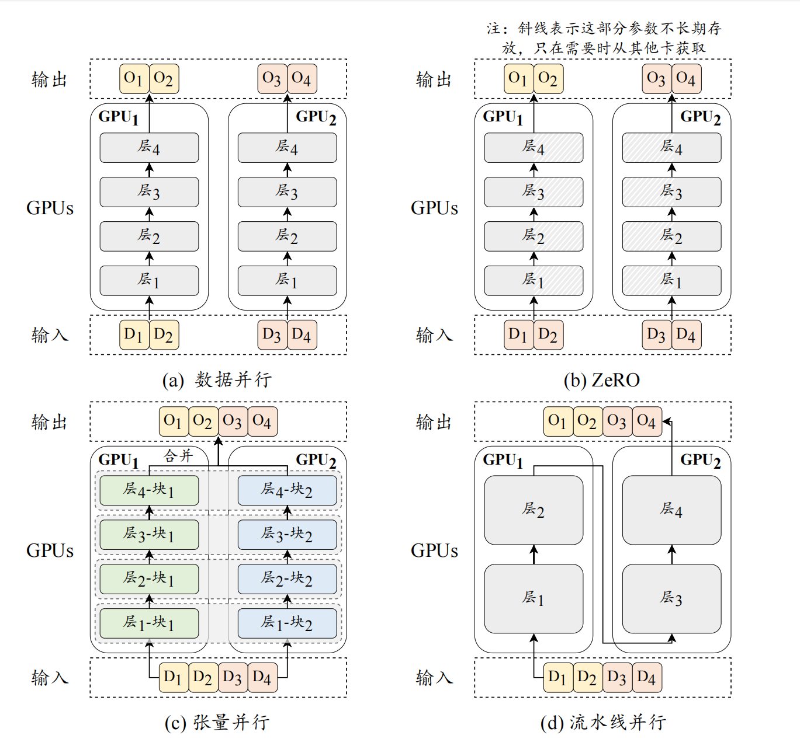

```
• 数据并行. 数据并行是一种提高训练吞吐量的方法，它将模型参数和优化器
状态复制到多个 GPU 上，然后将训练数据平均分配到这些 GPU 上。这样，每个GPU 只需要处理分配给它的数据，然后执行前向传播和反向传播以获取梯度。当所有 GPU 都执行完毕后，该策略会将不同 GPU 的梯度进行平均，以得到整体的梯度来统一更新所有 GPU 上的模型参数。
• 流水线并行. 流水线并行旨在将大语言模型不同层的参数分配到不同的GPU 上。在实践中，可以将 Transformer 连续的层加载到同一 GPU 上，以减少
GPU 之间传输隐藏状态或梯度的成本。例如，在图 6.3 (d) 中Transformer 的第 1-2层部署在 1 号 GPU，将 3-4 层部署在 2 号 GPU。然而，朴素的流水线调度并不能达到真正的并行效果。以图 6.3 (d) 为例，1 号 GPU 在前向传播后需要等待 2 号 GPU反向传播的结果才能进行梯度传播，因此整个流程是“1 号前向-2 号前向-2 号反向-1 号反向”的串行操作，大大降低了 GPU 的利用率。为了解决这一问题，流水线并行通常需要配合梯度累积（Gradient Accumulation）技术进行优化。该技术的主要思想是，计算一个批次的梯度后不立刻更新模型参数，而是累积几个批次后再更新，这样便可以在不增加显存消耗的情况下模拟更大的批次。在流水线并行中使用了梯度累积后，1 号卡前向传播完第一个批次后，便可以不用等待，继续传播第二个和后续的批次，从而提高了流水线的效率。
• 张量并行. 张量并行与流水线并行是两种将大模型参数加载到多个 GPU 上
的训练技术。流水线并行侧重于将模型的不同层分配到不同的 GPU 上。相较之下，张量并行的分配粒度更细，它进一步分解了模型的参数张量（即参数矩阵），以便更高效地利用多个 GPU 的并行计算能力。具体地，对于大语言模型中的某个矩阵乘法操作 𝑾𝑯，参数矩阵 𝑾 可以按列分成两个子矩阵 𝑾1 和 𝑾2，进而原式可以表示为 [𝑾1𝑯, 𝑾2𝑯]。然后，可以将参数矩阵 𝑾1 和 𝑾2 放置在两张不同的 GPU上，然后并行地执行两个矩阵乘法操作，最后通过跨 GPU 通信将两个 GPU 的输出组合成最终结果。常见的张量并行策略是分解模型注意力层的 𝑾𝑄，𝑾𝐾，𝑾𝑉，𝑾𝑂 矩阵参数和前馈网络层的 𝑾𝑈，𝑾𝐷 矩阵参数。
```

#### **零冗余优化器**

零冗余优化器（Zero Redundancy Optimizer, ZeRO）**主要用于解决数据并行中的模型冗余问题**，即每张 GPU 均需要复制一份模型参数。在图 6.3 (a) 中可以看到，数据并行时每个 GPU 都需要存储大语言模型的相同副本，包括模型参数和优化器参数等。对于每个 GPU，在模型传播到某一层时，其他层的模型和优化器参数并不参数计算，这导致了严重的显存冗余现象，同时也限制了每个 GPU 可以支持的前向传播数据量，降低了训练效率。为了解决这个问题，**ZeRO 技术仅在每个 GPU 上保留部分模型参数和优化器参数，当需要时再从其它 GPU 中读取**。如图 6.3 (b) 所示，模型被均分在两张 GPU 上，当需要使用第一层计算时，两张卡分别从对方获取相应的模型参数进行计算，使用完之后便可以释放相应显存，从而降低了显存冗余度。

#### **激活重计算**

激活重计算（Activation Recomputation），也称为梯度检查点（Gradient Checkpointing），是一种用于优化反向传播时显存占用的技术。具体来说，给定一个待优化函数 *𝒀* = *𝑿𝑾*，在反向传播时需要 *𝑿* 的值才能计算 *𝑾* 的导数，所以在前向传播时需要保留这些 *𝑿*（通常被称为激活值）。然而，保存每一层所有的激活值需要占用大量的显存资源（具体的显存占用见第 6.4.4 节）。因此，激活重计算技术在前向传播期间仅保留部分的激活值，然后在反向传播时重新计算这些激活值，以达到节约显存的目的，但是同时也会引入额外的计算开销。在大语言模型的训练过程中，激活重计算的常见方法是将 Transformer 的每一层的输入保存下来，然后在反向传播时计算对应层内的激活值。

#### **混合精度训练**

通过同时使用半精度浮点数（2 个字节）和单精度浮点数（4 个字节）进行运算，以实现显存开销减半、训练效率翻倍的效果。为了保证表示精度，需要保留原始 32 位模型的参数副本。但在训练过程中，会先将这些 32 位参数转换为 16 位参数，随后以 16 位精度执行前向传播和反向传播等操作，最后在参数更新时再对 32 位模型进行优化。由于在模型训练中前向传播和反向传播占用了绝大部分优化时间，混合精度训练因而能够显著提升模型的训练效率。

### **模型参数量计算与效率分析**

#### **参数量计算**

由于当前主流的大模型普遍采用因果解码器架构，因此下面以 LLaMA 模型为范例，深入剖析其参数数量计算方式。首先，假设词表大小为 *𝑉*，模型包含 *𝐿* 层解码器，中间状态的维度大小为 *𝐻*，前馈网络层的中间状态维度大小为 *𝐻* ′。我们主要关注计算以下几个部分的参数量：

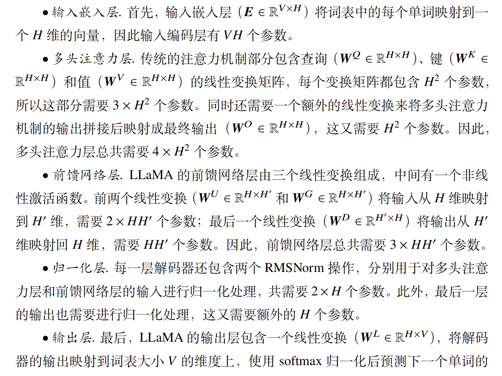

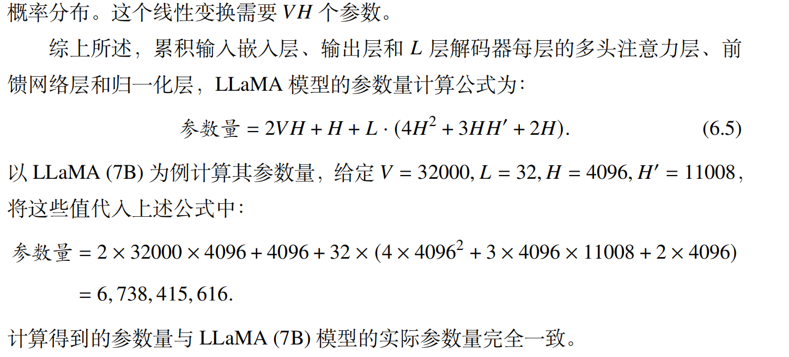

#### **训练运算量估计**

模型训练运算量指的是模型在训练过程中，需要进行的浮点运算次数（FloatingPoint Operations, FLOP）。这里的浮点运算包括浮点数的加减乘除运算，以及浮点数的指数函数，对数函数，三角函数等运算操作。使用 Transformer 架构进行训练的运算量主要集中在多头注意力计算和线性变换计算。相比之下，归一化、输出映射和旋转位置编码计算所需的运算量较少，而输入编码层则无需计算，因此后续的分析中省略了这些部分。在分析多头注意力和线性变换的运算量时，我们进一步设定以下参数：模型总参数量为 *𝑃*，批处理大小为 *𝐵*，输入序列长度为 *𝑇*，因此训练词元总数为 *𝐶* = *𝐵𝑇*；多头注意力机制包含 *𝑁* 个头，每个头的维度为 *𝐷*，因此和中间状态维度 *𝐻* 满足关系 *𝐻* = *𝑁𝐷*。其它定义与参数量计算一节 6.4.1 保持一致。

**矩阵乘法运算量**

矩阵 *𝑨* ∈ R *𝑛*×*𝑚* 和矩阵 *𝑩* ∈ R *𝑚*×*𝑝* 相乘所需的运算量为 2*𝑛𝑚 𝑝*。

```
每一行乘以每一列需要m次，相加需要m次
每一行乘以矩阵B总共需要2mp次
A乘以矩阵B总共需要2nmp次
```

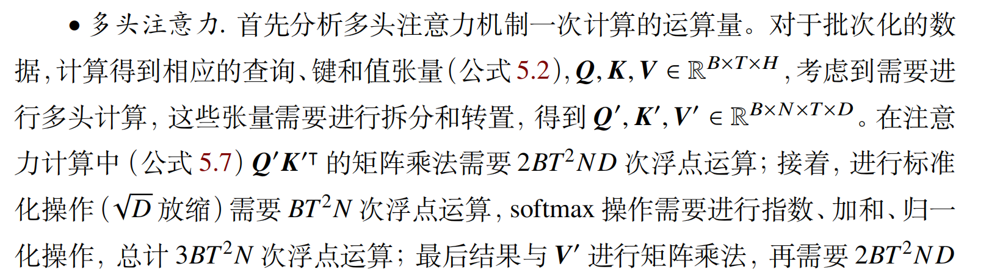

```
后向传播的运算量大致为前向传的两倍：
考虑到 Transformer 结构中大多数运算为二元运算（如两个矩阵相乘），需要分别计算损失对两个矩
阵的梯度（对权重梯度；对输入梯度 ），因此需要两倍的运算量。
对输入梯度：
即使输入数据本身不需要更新（如训练集中的样本），其梯度仍需计算，以确保前一层（如更靠近输入的层）的参数能够接收到正确的梯度信号。
```

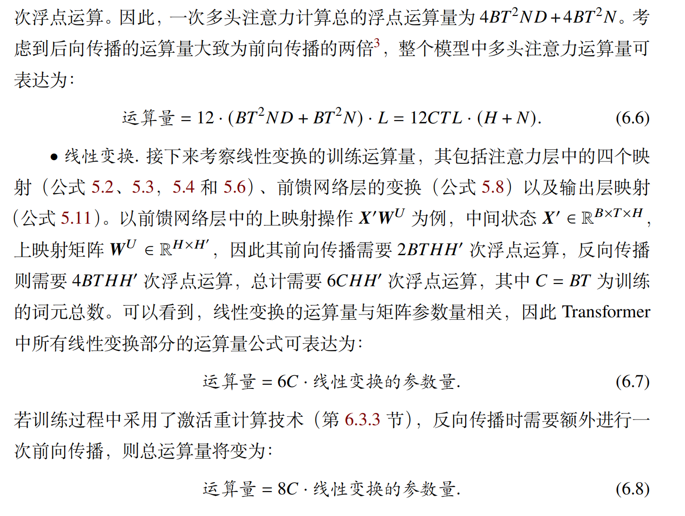

```
激活重计算技术（Activation Recomputation，也称为梯度检查点）的核心目的是通过牺牲计算时间来减少内存占用。在反向传播时“多计算一次”的本质是：由于前向传播阶段未保存全部中间激活值，反向传播时需要重新计算这些丢弃的激活值，导致额外的计算开销
相当于重新进行了一次前向传播


12(H+N)L

H`
```

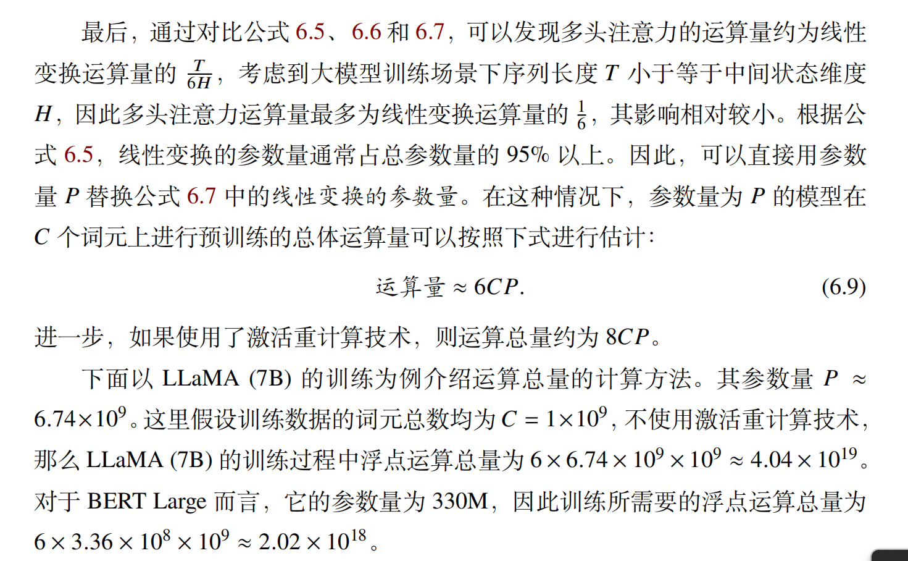

#### **训练显存估计**

接下来讨论如何估计模型在训练中需要的显存资源占用，主要可以分为三个部分：模型参数与优化器、训练中需要保存的激活值和其他显存占用。

**模型参数与优化器**

模型参数和模型梯度通常以 16 位浮点数存储，而 Adam 或 AdamW

优化器则需要额外存储 32 位浮点数的模型参数、动量参数以及动量二阶矩参数。

不使用 *ZeRO* 优化技术*.* 在这种情况下，由于一个 16 位浮点数需要 2 字节，一个 32 位浮点数需要 4 字节，因此模型参数和模型梯度各需要 2*𝑃* 字节的显存，Adam 优化器的模型参数、动量参数以及动量二阶矩参数则各需要 4*𝑃* 字节的显存。通过对于这些显存占用进行累和，每张 GPU 上会需要使用 (2+2+4+4+4) ·*𝑃* = 16*𝑃*字节的显存用于存储模型参数与优化器。

**训练激活值的显存占用**

在大模型的训练期间，前向传播中需要保留每层的激活值（中间状态），来用于后续反向传播中计算梯度并更新模型参数

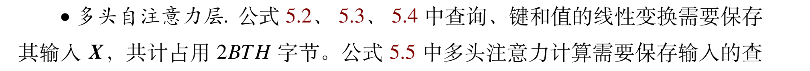

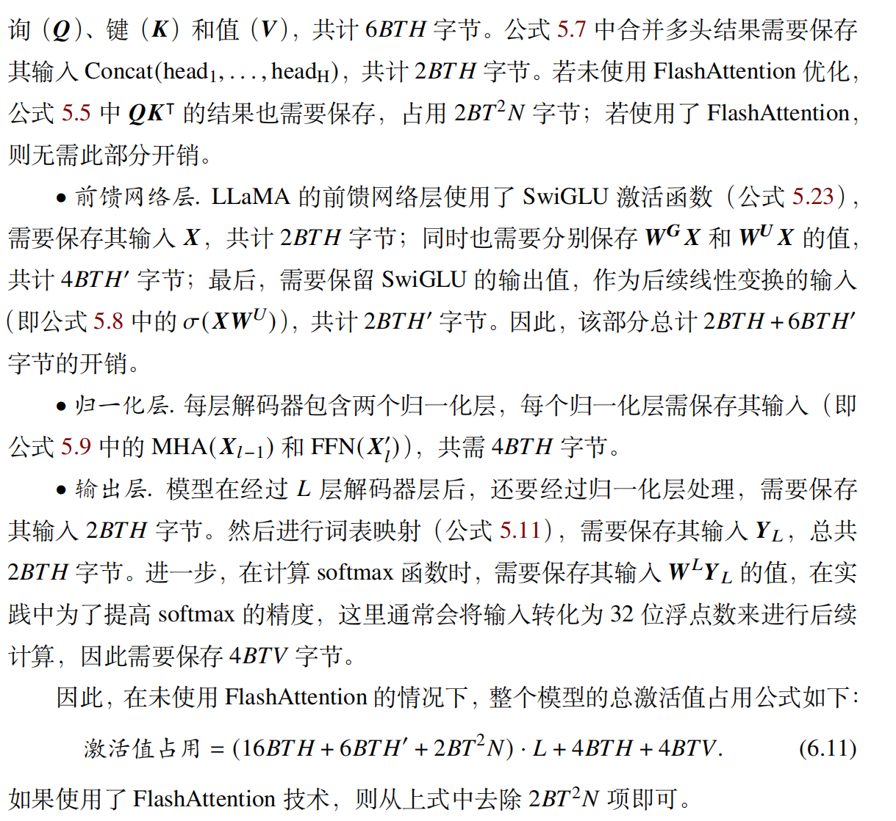

**SwiGLU激活函数**

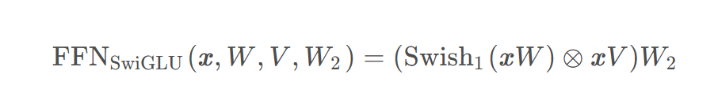

## 指令微调

### LoRA

低秩适配（Low-Rank Adaptation, LoRA）微调技术

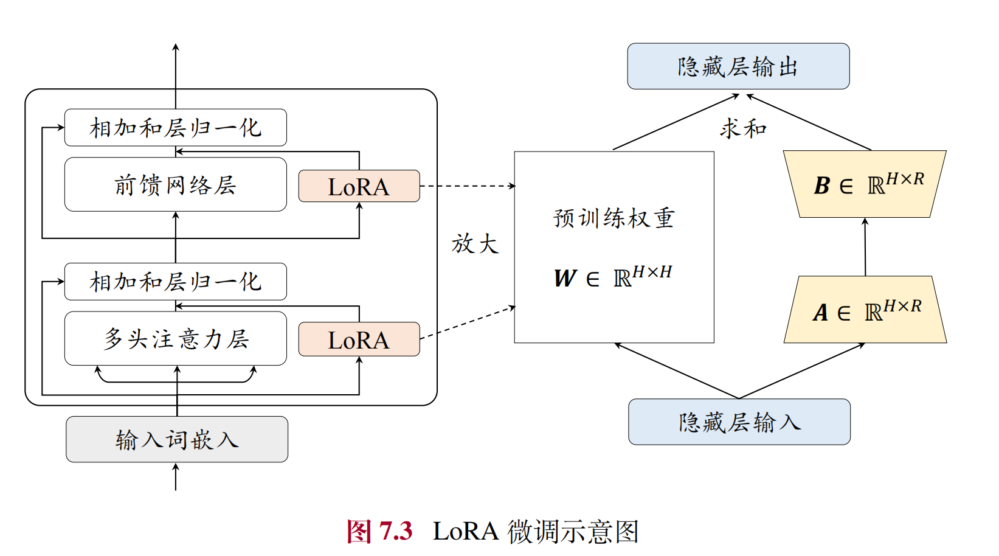

模型在针对特定任务进行适配时，参数矩阵往往是过参数化（Over-parametrized）的，其存在一个较低的内在秩。

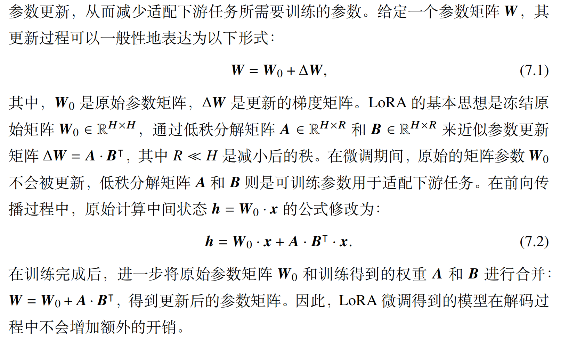

### **LoRA显存占用**

这里假设 LoRA 需要训练的参数量为 *𝑃*_LoRA，模型原始参数为P

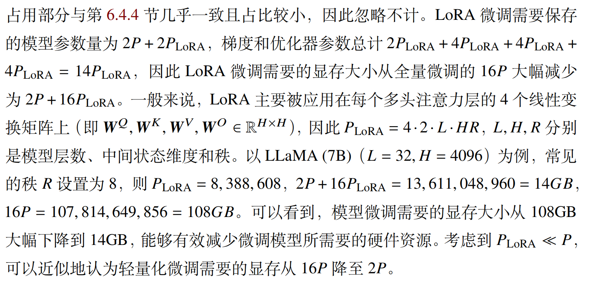

## **人类对齐**

基于人类反馈的强化学习（Reinforcement Learning from Human Feedback, RLHF）

尽管大语言模型在下游任务中表现出优秀的性能，这些模型有时会出现错误或具有危害性的行为，例如无法正确遵循指令、生成虚假信息、以及产生有害、有误导性以及带有偏见的表达。

旨在保证大语言模型的行为与人类期望和价值观相一致

RLHF 首先需要收集人类对于不同模型输出的偏好，然后使用收集到的人类反馈数据训练奖励模型，最后基于奖励模型使用强化学习算法（例如 Proximal Policy Optimization, PPO ）微调大语言模型。

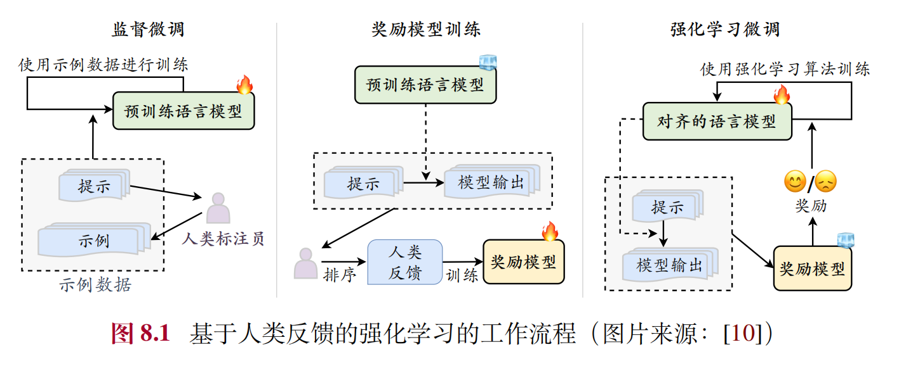

### **PPO** **介绍**

近端策略优化（Proximal Policy Optimization, PPO）算法是强化学习领域的一种重要优化方法，主要用于训练能够根据外部环境状态做出行为决策的策略模型。PPO 算法在策略梯度算法的基础上，主要使用优势估计来更加准确的评估决策轨迹能获得的奖励，使用了重要性采样来进行离线策略训练。此外，为了保证重要性采样的稳定性，PPO 算法通过在目标函数中加入了梯度裁剪以及相关的惩罚项来减小采样误差。为了能够实现上述优化过程，PPO 在策略模型和奖励模型的基础上，还引入了参考模型和评价模型

#### 优势估计

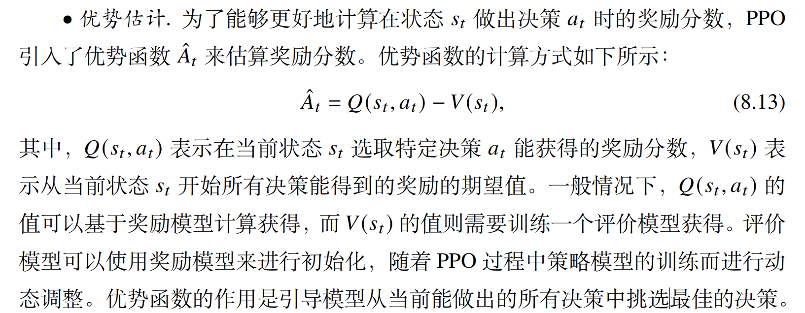

在 PPO 的优势函数中，通过将决策的奖励与期望奖励做差，产生较低奖励的决策将会得到一个负的优势值，而产生较高奖励的决策会得到一个正的优势值。这些相对较差的决策就会被抑制，同时鼓励策略模型产生收益更高的决策。因此，优势函数可以帮助策略模型学习在众多决策中做出更好的选择。

#### 重要性采样

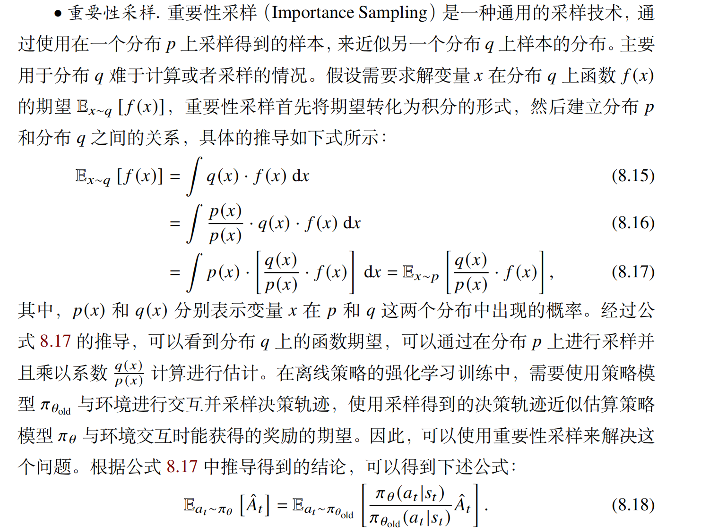

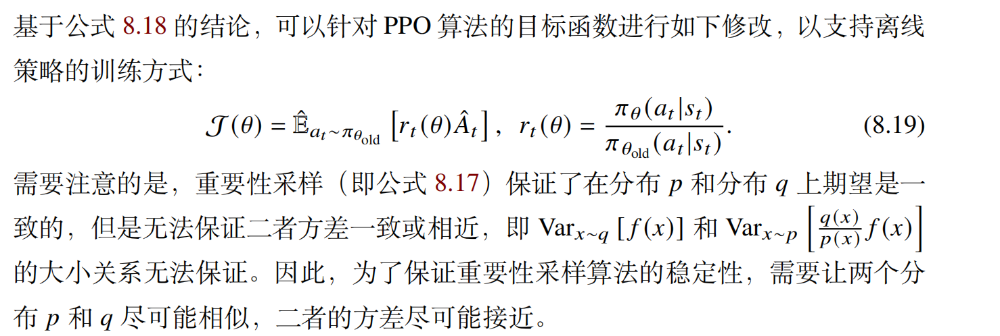

#### 基于梯度裁剪的目标函数

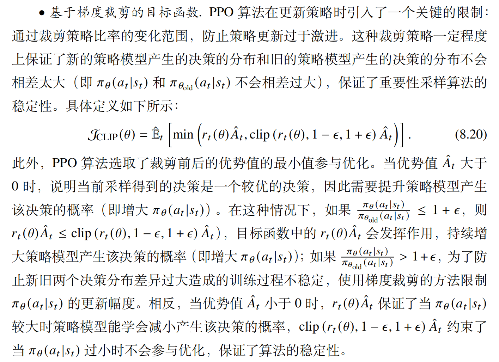

#### KL散度

```
第一项：鼓励策略向高优势动作方向更新（最大化回报）。
第二项（KL惩罚项）：限制策略变化的幅度（最小化KL散度）。
参数 β：控制“最大化回报”与“限制策略变化”之间的权衡。

D_kl>d_target:说明策略变化过大，需增大β，加强惩罚力度。使得更新幅度减小
D_kl<d_target:说明策略变化过小，可减小β，允许更大更新。使得更新幅度增大
```

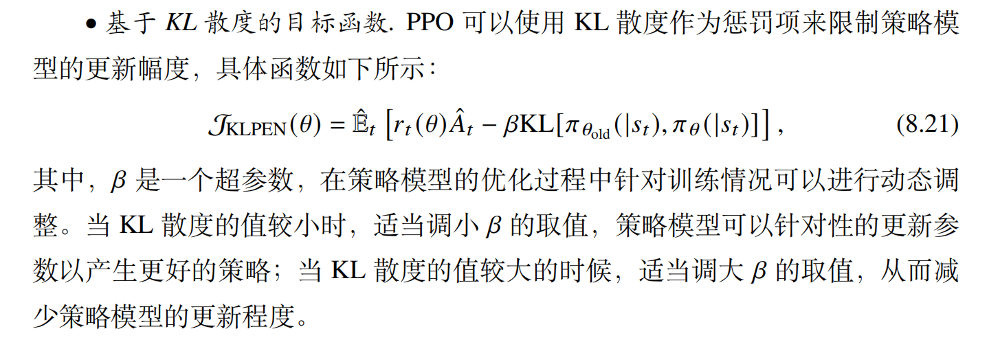

#### 算法流程

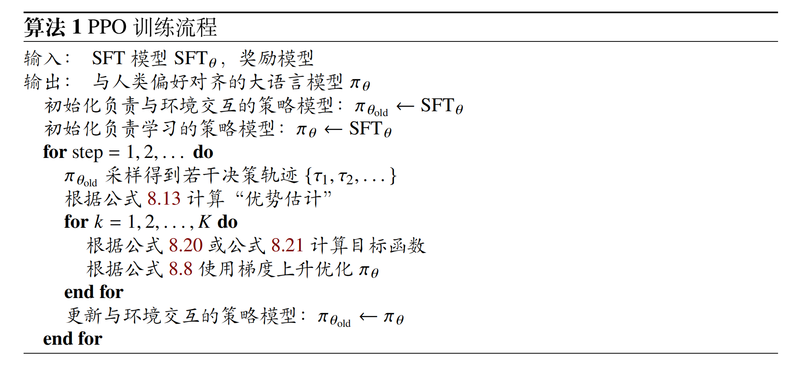

### **基于监督微调的对齐方法(非强化学习的对齐方法)DPO**

尽管 RLHF 已被证明是一种较为有效的语言模型对齐技术，但是它也存在一些局限性。首先，在 RLHF 的训练过程中，需要同时维护和更新多个模型，这些模型包括**策略模型、奖励模型、参考模型以及评价模型**。这不仅会占用大量的内存资源，而且整个算法的执行过程也相对复杂。此外，RLHF 中常用的近端策略优化算法在优化过程中的稳定性欠佳，对超参数的取值较为敏感，这进一步增加了模型训练的难度和不确定性。

**直接偏好优化（Direct Preference Optimization, DPO）**是一种不需要强化学习的对齐算法。由于去除了复杂的强化学习算法，DPO 可以通过与有监督微调相似的复杂度实现模型对齐，不再需要在训练过程中针对大语言模型进行采样，同时超参数的选择更加容易。

```
DPO 算法的主要思想是在强化学习的目标函数中建立决策函数与奖励函数之间的关系，以规避奖励建模的过程。形式化地，DPO 算法首先需要找到奖励函数 𝑟(𝑥, 𝑦) 与决策函数 𝜋𝜃 (𝑦|𝑥)之间的关系，即使用 𝜋𝜃 (𝑦|𝑥) 来表示 𝑟(𝑥, 𝑦)。
```

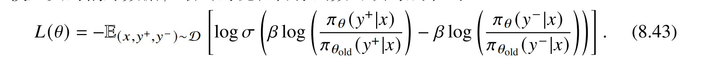

与 RLHF 算法相比，DPO 算法没有采用强化学习算法来训练奖励模型，而是通过监督微调的方式对于语言模型进行训练。与传统有监督微调方法不同，DPO 算法中不仅训练模型生成符合人类偏好的内容，同时降低模型生成不符合人类偏好内容的概率。相比于强化学习算法 PPO，DPO 在训练过程中只需要加载策略模型和参考模型，并不用加载奖励模型和评价模型。因此，DPO 算法占用的资源更少、运行效率更高，并且具有较好的对齐性能，在实践中得到了广泛应用。

### RLHF和SFT的对比

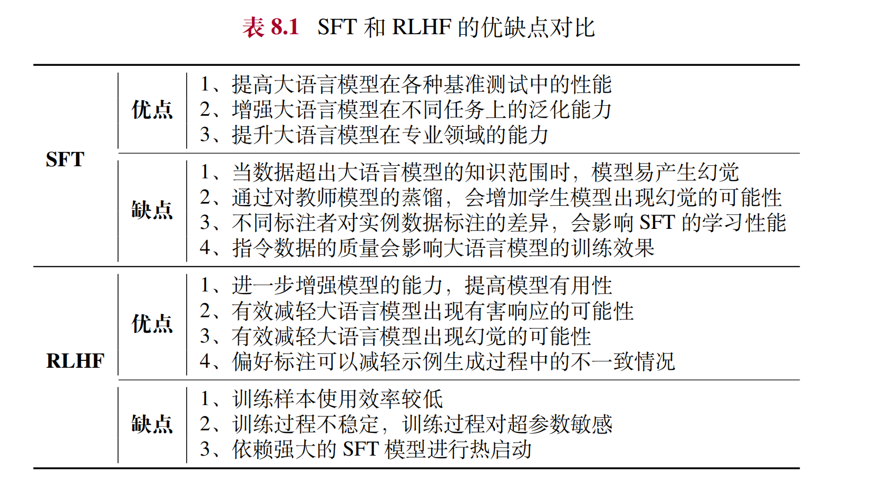

在 RLHF 中，我们首先学习一个奖励模型，然后利用该奖励模型通过强化学习算法（如 PPO）来改进大语言模型。而在 SFT 中，我们则采用了 Teacher-Forcing 的方法，直接优化模型对实例输出的预测概率。从本质上说，SFT 所采用的这种词元级别的训练方式是一种“行为克隆”。它利用教师的行为数据（即每个步骤的目标词元）作为监督标签，来直接训练大语言模型模仿教师的行为。在实现上，SFT 主要依赖于序列到序列的监督损失来优化模型，而 RLHF 则主要关于 SFT 和 RLHF 的进一步讨论过强化学习方法来实现大模型与人类价值观的对齐。本质上来说，为了学习教师的生成策略，SFT 采用了基于示例数据的“局部”优化方式，即词元级别的损失函数。作为对比，RLHF 则采用了涉及人类偏好的“全局”优化方式，即文本级别的损失函数。

#### SFT的缺点

关于 SFT，其作用在于“解锁”大语言模型的能力，而非向大语言模型“注入”新能力。当待学习的标注指令数据超出了大语言模型的知识或能力范围，例如训练大语言模型回答关于模型未知事实的问题时，可能会加重模型的**幻象**（Hallucination）行为。

作为一种基于行为克隆的学习方法，SFT 旨在模仿构建标注数据的教师的行为，而无法在这一过程中进行有效的行为探索。然而，标注者在写作风格、创作水平和主题偏好等方面经常存在一定的差异，这些都会使得标注数据中出现不一致的数据特征，进而影响 SFT 的学习性能。因此，在 SFT 阶段，**高质量的指令数据**（而非数量）是影响大语言模型训练的主要因素。

#### RLHF的缺点

RLHF 通过对比模型的输出数据（区分“好”输出与“坏”输出）来指导大语言模型学习正确的生成策略，它不再强迫大语言模型模仿教师的示例数据，因此可以缓解上述提到的 SFT 所导致的幻象问题。

RLHF继承了经典强化学习算法的缺点，**如样本学习效率低和训练过程不稳定等问题。**

RLHF 的过程通常会持续多轮，这是一个复杂的迭代优化过程，其中**涉及了很多重要细节的设定**（例如提示选择、奖励模型训练、PPO的超参数设置以及训练过程中对超参数的调整），都会影响整个模型的性能，对于精确的高效复现提出了较大挑战。

#### 总结

总的来说，SFT 特别适合预训练后增强模型的性能，具有实现简单、快速高效等优点；而 RLHF 可在此基础上规避可能的有害行为并进一步提高模型性能，但是实现较为困难，不易进行高效优化。

## 模型部署

### 模型蒸馏

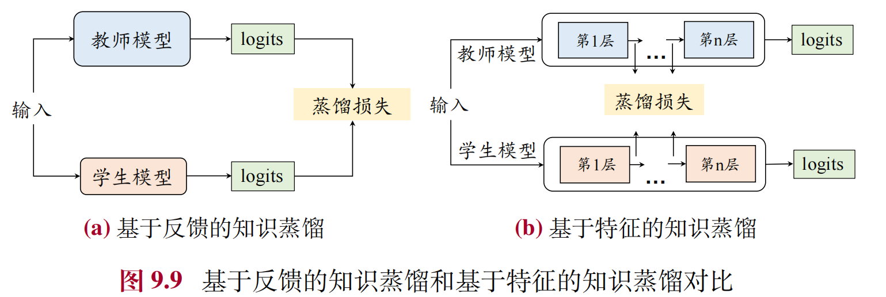

模型蒸馏（Model Distillation）的目标是将复杂模型（称为教师模型）包含的知识迁移到简单模型（称为学生模型）中，从而实现复杂模型的压缩。

模型蒸馏的核心思想是，引入额外的损失函数（称为蒸馏损失函数），训练学生模型的输出尽可能接近教师模型的输出。

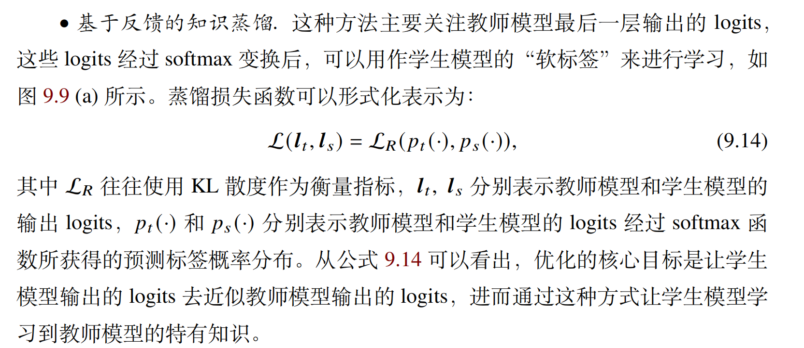

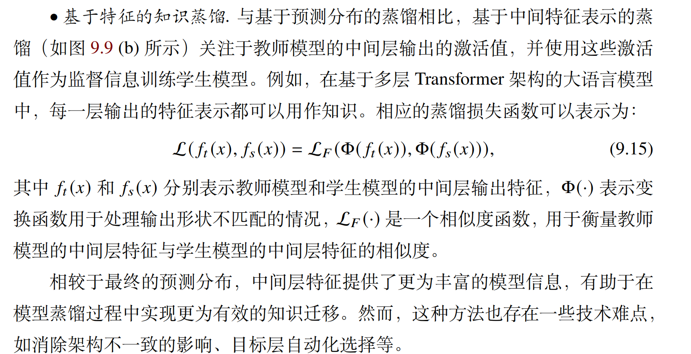

相较于最终的预测分布，中间层特征提供了更为丰富的模型信息，有助于在模型蒸馏过程中实现更为有效的知识迁移。