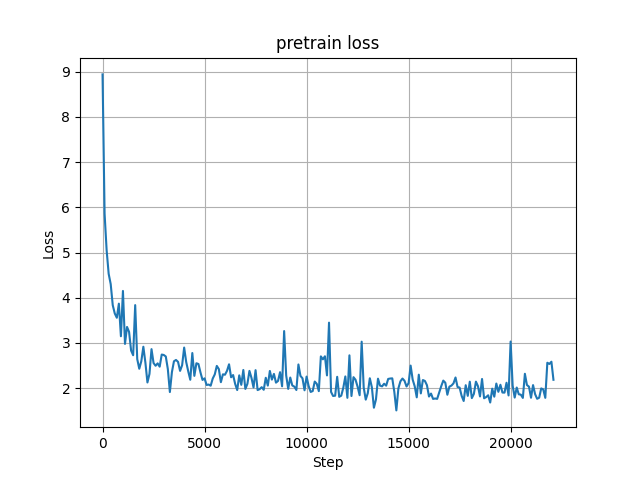
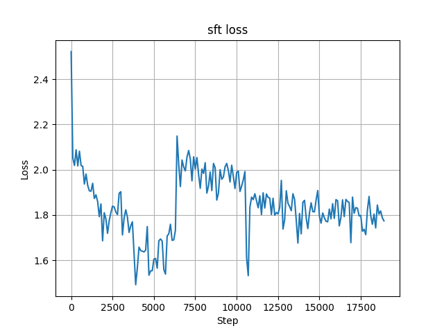
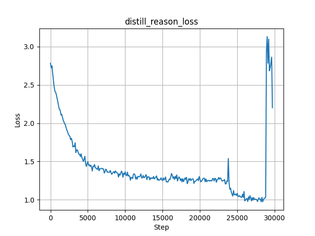
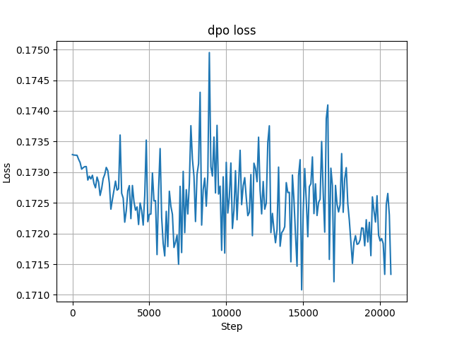

# minimind-文本模型

从零开始复现 minimind 项目的技术实现过程，成功构建了一个参数量仅 25.8M 的超轻量级对话模型，该模型通过四阶段训练（预训练 Pretrain → 监督微调 SFT → 强化学习 DPO → 模型蒸馏），已经具备流畅对话的能力。

模型架构采用精简的 Decoder-Only Transformer 结构，在技术实现上进行了多项优化：

* 去掉transformer架构的绝对位置编码，采用旋转位置编码(RoPE)
* 注意力机制模块采用GQA技术
* 推理阶段使用KVcache技术加速模型推理
* 实现混合专家（MoE）扩展版本，可将 FFN 模块替换为 MoE


核心代码均基于Pytorch,不依赖第三方库的抽象接口。

在单卡NVIDIA 4090完成训练全过程

## 训练过程

### Pretrain阶段

这个阶段主要是要让模型从大量的数据集学会如何进行词语接龙,只需要将大量高质量的数据集交给模型进行无监督学习即可

### SFT阶段

经过预训练得到的模型只会进行词语接龙而无法与人进行聊天，这时就需要对模型施加一个自定义的\[问题 -> 回答\]形式的聊天模板来对模型进行有监督微调

训练时采用如下所示的ChatML格式的对话模板

    <s>system
    你是 MiniMind，是一个有用的人工智能助手。</s>
    <s>user
    用户提问</s>
    <s>assistant
    回答</s>

模板中的system标签为模型的回复设定了整体的基调或风格

### RLHF阶段

经过SFT得到的模型具备了一定的对话能力，但此时模型的回答尚未与人类的回答进行对齐，也就是模型并不知道哪些回答是好的，哪些回答是不好的，这时候就需要使用强化学习的方式来使得模型的回答与人类的偏好进行对齐。

训练时采用了DPO算法，相较PPO算法大大节省了显存消耗。

```
## chosen
<s>system
你是 MiniMind，是一个有用的人工智能助手。</s>
<s>user
Q</s>
<s>assistant
good answer</s>

## rejected
<s>system
你是 MiniMind，是一个有用的人工智能助手。</s>
<s>user
Q</s>
<s>assistant
bad answer</s>
```

### 知识蒸馏阶段

知识蒸馏就是学生模型面向教师模型学习的过程，学生模型是一个较小的模型，目标是学习教师模型的行为，而不是从原始的数据中进行学习。在SFT学习中，模型的目标是拟合词Token分类硬标签（hard labels），而在知识蒸馏时，模型的目标是拟合教师模型的softmax概率分布，也即软标签(soft labels)。

进一步，对于某些闭源模型，由于无法获取其内部结构，所以可以直接面向它所输出的数据学习，这个过程又被称为黑盒蒸馏。

为了使模型快速获得推理的能力，在训练过程中直接对已有推理能力的模型进行黑盒蒸馏，让模型的回答符合如下的模板

在本项目中基于微调模型做进一步的蒸馏学习。

    <think>\n思考过程\n</think>\n
    <answer>\n最终回答\n</answer>

为了防止模型总是脱离模板回答，可以按照如下方式增大标记位置token的损失惩罚

    loss_mask[sp_ids] = 10

## 训练结果

| 训练阶段     | loss图像                                             | 模型效果                                                     |
| ------------ | ---------------------------------------------------- | ------------------------------------------------------------ |
| pretrain阶段 |        | 👶: “大语言模型”是<br/><br/>🤖️: 近年来备受关注的话题。大自然的语言模型如COP OL-19（IoTRTETE）、字节奏序列等技术都已经开始使用这种技术。这些技术在自然语言处理、语义分析、文本分类等任务中取得了显著的成果，并被广泛应用于信息抽取、情感分析、机器翻译等领域。”“大型语言模型”在自然语言处理、语义分析、文本分类等任务中表现出色。这些技术在自然语言处理、语义分析、文本分类等任务中取得了显著的成果，并被广泛应用于信息抽取、情感分析、机器翻译等领域。 |
| sft阶段      |        | 👶: 请为我讲解“大语言模型”这个概念。<br/><br/>🤖️: 大语言模型是一种通过机器学习算法来生成文本的机器模型。它可以从大规模数据中学习语言的规律和特征，并用于处理和生成自然语言。这种模型通常用于生成自然语言文本，并在社交媒体和在线广告等平台上进行。 |
| RLHF阶段     |  | 👶: 请为我讲解“大语言模型”这个概念。<br/><br/>🤖️: 大语言模型是一种基于统计学习的技术，它能够自动提取出大量有意义的单词，并以此为基础进行处理。它可以通过多种方式对文本进行分类，包括新闻、小说、故事等。它可以用于许多领域，如社交媒体、电子商务、金融等。 |
| 蒸馏推理     |            | 👶: 请为我讲解“大语言模型”这个概念。<br/><br/>🤖️:<think><br/>嗯，用户说“大语言模型”这个概念，我需要知道具体是哪个概念。大数据分析是指从大量数据中提取出规律，以便帮助人们更好地理解信息。而“大语言模型”则是指利用人工智能技术，构建一个多语言模型，用于处理语言语言的任务，如自然语言处理、信息提取、机器翻译等。<br/></think><br/><answer><br/>这个概念在计算机科学和人工智能领域中有广泛的应用。首先，大数据分析涉及到对大规模数据的分析和处理，因此可以预测和分析大量的文本数据，以便更好地帮助人类处理。其次，大数据分析可以帮助人们更好地理解和分析文本数据，包括文章的结构、情感、结构等方面。<br/></answer> |


相对来说，SFT后得到的模型在简洁性与准确性方面表现更好，而RLHF后得到的模型则更倾向于给出背景知识，同时准确性也有待提升。


训练到最后一部分数据时训练loss突然增高，可能是因为数据清洗不干净导致最后一部分数据包含大量噪声所导致，后续可考虑去掉这部分数据后重新训练一次。

# minimind-视觉模型


复现了 minimind-v 视觉语言模型的技术实现，成功构建了参数量仅 26M 的超轻量级多模态对话模型，该模型通过双阶段训练（视觉预训练 + 指令微调），实现了视觉语言理解与对话的核心能力。

模型架构上，采用语言模型作为基座语言模型，仅增加了Visual Encoder与特征投影两个子模块，以支持多种模态信息输入。

具体来说，使用CLIP-ViT-Base作为Visual Encoder，特征投影方式采用与LlaVA-1相同的方式，即直接采用一个无偏的线性变换完成这个操作

<div style="text-align: center;">
    
</div>

## 训练过程

模型训练采用类似LLaVA两阶段训练的方式

### Pretrain阶段


特征对齐预训练，这个阶段目标是学习图片种的通用知识。

具体操作时，这个阶段将CLIP模型得到的image token embedding对齐到text word embedding的语义表达空间，这个阶段训练时冻结Vision Encoder和LLM模型的权重参数，**只训练特征投影层W的权重**

训练时vlm的输入依然是文本，其中包含图片的占位符，采用的模板如下:

    这个图像中有什么内容？<image>
    # 训练时将<image>替换为特殊字符即占位符（196个)，最后将视觉模型的输出填入其中
    
    <s>system
    你是 MiniMind，是一个有用的人工智能助手。</s>
    <s>user
    提供给定图像的简要描述。<image></s>
    <s>assistant
    回答</s>

在计算好文本嵌入后，用Vision Encoder生成的向量替换图片占位符的embedding，完成替换后模型的计算过程与基座语言模型的基座过程就完全相同了。


### SFT阶段

端到端微调，这个阶段主要学习对图片提问的真实问答格式

具体操作时，这个阶段依然冻结Vision Encoder的权重，训练时**同时更新特征投影层W与LLM语言模型的权重**

## 训练结果

训练时loss的变换情况如下

 


对模型进行测试，结果如下

<table>
  <thead>
    <tr>
      <th>图片</th>
      <th>Pretrain_vlm</th>
      <th>SFT_vlm</th>
    </tr>
  </thead>
  <tbody>
    <tr>
      <td>
        
        &nbsp;&nbsp;&nbsp;&nbsp;&nbsp;&nbsp;&nbsp;&nbsp;&nbsp;&nbsp;&nbsp;&nbsp;&nbsp;&nbsp;&nbsp;&nbsp;&nbsp;&nbsp;&nbsp;&nbsp;&nbsp;&nbsp;&nbsp;&nbsp;&nbsp;&nbsp;&nbsp;&nbsp;
      </td>
      <td>冬季的雪景，有很多树</td>
      <td>这幅图像描绘了一个美丽的冬日场景，一棵树在背景中，背景是树木和树木。一棵树被大雪盖着，这暗示了这是一个宁静的冬日场景。在图像中，一棵树被大雪盖住了，为这棵树增添了温暖和宁静感</td>
    </tr>
    <tr>
      <td>
        
        &nbsp;&nbsp;&nbsp;&nbsp;&nbsp;&nbsp;&nbsp;&nbsp;&nbsp;&nbsp;&nbsp;&nbsp;&nbsp;&nbsp;&nbsp;&nbsp;&nbsp;&nbsp;&nbsp;&nbsp;&nbsp;&nbsp;&nbsp;&nbsp;&nbsp;&nbsp;&nbsp;&nbsp;
      </td>
      <td>一只鸟站在树木上</td>
      <td>在这幅图片中，一只白色的鸟正站在一块长满青草的树木上，似乎是水域的自然栖息地。这种环境通常被称为“水母”等自然或生态活动所吸引， 因为它们被树木环绕、树木繁密。这些树木的存在表明这只动物可能在自然环境中寻找食物和水源，或者只是为了在水中休息。</td>
    </tr>


观察发现，仅经过预训练的视觉语言模型生成的文本描述普遍较为简短，但对图像内容的描述相对精准，而经过微调后的模型在生成文本长度上显著增加，却伴随明显的幻觉现象（hallucination），出现了图像内容的错误描述

这种现象可能是由于训练数据分布差异所导致的，因为预训练时的数据集中的文字描述多采用短句，而微调时使用的数据是图片提问的真实问答格式，文本长度相对较长

实际上对于llm来说，图片的视觉信息可以被看作是一种特殊的外语，因此当llm能力越强，其学习外语的能力就越强，对应的vlm的能力就越强